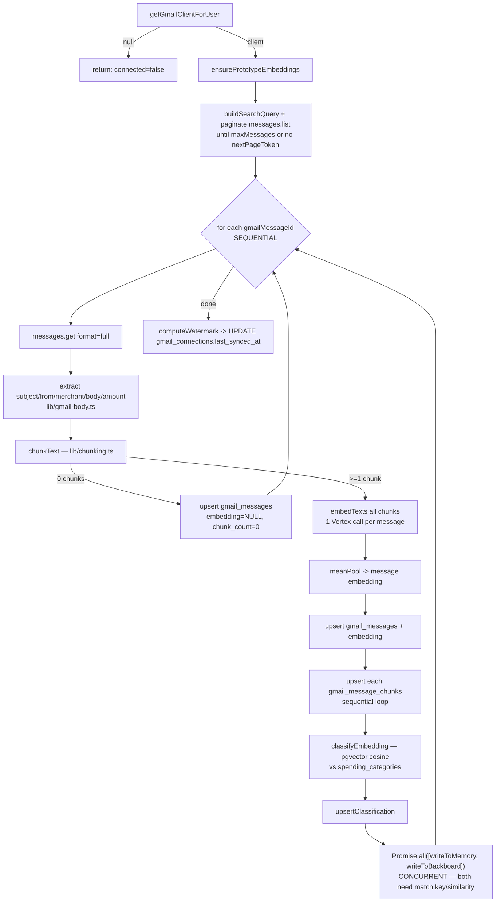

# Gmail Connector Service

**Branch:** `gmail-connector` (`origin/gmail-connector`) · **Subdomain:** `gmail.getvouch.club`
**Repo:** `acme-1b76/vouch` (single repo, single shared Tiger/Postgres DB, per-branch subdomain — see root `CLAUDE.md`)

This document is a from-the-code deep dive into the `gmail-connector` service branch, written against the branch's own `docs/GMAIL.md` and `CLAUDE.md` as a baseline and verified line-by-line against the actual source. It is the most complex of the Vouch service branches: it's both a Google OAuth connector *and* a financial-email ETL pipeline with its own general-purpose memory subsystem and an optional third-party sync. Discrepancies between this document and the branch's own `docs/GMAIL.md` are called out inline (search for **"vs. GMAIL.md"**) and summarized at the end.

---

## Table of contents

1. [Purpose & role in the onboarding chain](#1-purpose--role-in-the-onboarding-chain)
2. [File & directory structure](#2-file--directory-structure)
3. [Google OAuth flow](#3-google-oauth-flow)
4. [API routes](#4-api-routes)
5. [The sync pipeline, end to end](#5-the-sync-pipeline-end-to-end)
6. [The memory subsystem](#6-the-memory-subsystem-libmemory)
7. [Backboard.io integration](#7-backboardio-integration-libbackboardts)
8. [Database schema — all 13 migrations](#8-database-schema--all-13-migrations)
9. [Cron sync](#9-cron-sync-appapicrongmail-syncrouteets)
10. [Environment variables](#10-environment-variables)
11. [Testing setup](#11-testing-setup)
12. [Notes vs. the branch's own docs/GMAIL.md](#12-notes-vs-the-branchs-own-docsgmailmd)

---

## 1. Purpose & role in the onboarding chain

Vouch's onboarding is a chain of independently-deployed service branches sharing one session cookie and one Postgres DB:

```
signup/login (portal)  →  Gmail (this branch)  →  bank-connection  →  voice registration
```

This branch does two distinct jobs, both gated behind the same read-only Gmail OAuth connection:

1. **A connector UI** (`/connect`) that lets an already-authenticated Vouch user link their Gmail account read-only, see it's connected, peek at their 5 most recent messages live, or disconnect. This is the user-facing half — a widget (`components/gmail-connector.tsx`) that was originally embedded in a login-extend page upstream and is now this branch's entire page.
2. **A financial email pipeline** (`lib/gmail-sync.ts`, `syncGmailForUser()`) that, once connected, imports financially-relevant messages (receipts, invoices, subscription billing), extracts structured fields, embeds and classifies them by spending category, and writes them into both a standalone bitemporal **memory subsystem** (`lib/memory/*`) and, optionally, into **Backboard.io**'s persistent memory API.

Both halves are gated by the same shared `vouch_session` cookie (HS256 JWT, `{ userId, email }`, `JWT_SECRET` shared across every service branch, cookie domain `.getvouch.club`) — there is no login/signup UI on this branch; a signed-out visitor is bounced to `PORTAL_LOGIN_URL`. On success (`/api/connectors/gmail/callback`) or on "Skip for now" (a plain link on `/connect`), the user is forwarded to `BANK_CONNECTION_URL`, the next step in the chain.

Adapted from `aaditisinghal/vouch-aaditi`'s `feature/gmail-connector` branch (commit `55eedf7`, "Add Gmail financial email pipeline, memory subsystem, and Backboard sync") — she removed the connector from her branch before merging her login/signup work into `portal`, so it was ported here as its own long-lived service branch instead of losing the work. The adaptation pattern is consistent everywhere: `lib/db.ts`'s `pool` is a **named** export here (not default), `lib/crypto.ts` uses this repo's `encryptSecret`/`decryptSecret` (base64 `ENCRYPTION_KEY`, shared with `bank-connection` and `voice-verification`) instead of her hex-key `encrypt`/`decrypt`, auth goes through `lib/session.ts`'s `requireUser()`/`getCurrentUser()` instead of a manual `verifySession(cookie)` call in every route, and every `user_id` column is `TEXT` (matching `users.id` elsewhere in this shared DB) instead of her original `UUID`.

---

## 2. File & directory structure

### API routes (Gmail OAuth + data)

| File | Purpose |
|---|---|
| `app/api/connectors/gmail/connect/route.ts` | `GET` — starts the OAuth handshake: builds the Google consent URL, sets a one-time CSRF `state` cookie, redirects. |
| `app/api/connectors/gmail/callback/route.ts` | `GET` — OAuth redirect target: exchanges the code, stores encrypted tokens, fires a non-fatal initial sync, redirects to bank-connection. |
| `app/api/connectors/gmail/status/route.ts` | `GET` — reports whether the current user has a Gmail connection (`connected`, `email`, `connectedAt`). |
| `app/api/connectors/gmail/disconnect/route.ts` | `POST` — best-effort revokes the token with Google, deletes the stored connection. |
| `app/api/connectors/gmail/messages/route.ts` | `GET` — live-fetches the user's 5 most recent Gmail messages (not from the DB) for the "View recent emails" UI. |
| `app/api/cron/gmail-sync/route.ts` | `POST` — Bearer-gated batch job: runs `syncGmailForUser()` for every connected user since their own watermark. |
| `app/api/health/route.ts` | `GET` — plain DB connectivity check (`select now(), version()`), no auth. |

Each route above (except `health`) has a `__tests__/route.test.ts` sibling — see [§11](#11-testing-setup) for what each locks in.

### Pages & UI

| File | Purpose |
|---|---|
| `app/connect/page.tsx` | The connector page — the entirety of this branch's UI. Redirects signed-out visitors to the portal; renders `<GmailConnector>` plus a "Skip for now" link to `BANK_CONNECTION_URL`. |
| `app/layout.tsx` | Root layout — minimal `<html>/<body>` shell, `"Vouch"` metadata title. |
| `app/page.tsx` | `/` — a plain client-side health-check page (calls `/api/health`, renders connected/not-connected). Not part of the onboarding flow. |
| `app/globals.css` | Tailwind v4 import + `color-scheme: light dark` + a system-font body reset. |
| `components/gmail-connector.tsx` | Client component: connection status, "Connect Gmail" CTA, connected-state view with "View recent emails" / "Disconnect", inline error-code-to-message mapping. |
| `components/gmail-icon.tsx` | Plain `` wrapper around `public/gmail-logo.png` (deliberately not `next/image` — only ever rendered at 16–20px inline next to text). |
| `components/__tests__/gmail-connector.test.tsx` | Locks in every UI state of the connector widget (see §11). |
| `public/gmail-logo.png`, `public/logo1.png` | Static image assets (Gmail logo; Vouch wordmark used on `/connect`). |

### Core libraries

| File | Purpose |
|---|---|
| `lib/auth.ts` | Re-exports the session-token primitives from `lib/session-token.ts` plus `getUserById()` (the one place in this file that touches the DB). |
| `lib/session.ts` | `getCurrentUser()` / `requireUser()` (throws `UnauthorizedError`) built on `lib/auth.ts` — the auth surface every route/page actually calls. |
| `lib/session-token.ts` | Pure JWT logic (no DB import — must run on the Edge runtime inside `middleware.ts`). Defines `SESSION_COOKIE = "vouch_session"`, the `{userId, email}` payload shape, sign/verify via `jose`, and cookie options. Must match the portal branch's JWT contract exactly. |
| `lib/crypto.ts` | AES-256-GCM `encryptSecret`/`decryptSecret` for OAuth tokens at rest, keyed by `ENCRYPTION_KEY` (base64, 32 bytes). |
| `lib/db.ts` | Lazily-constructed, hot-reload-safe `pg.Pool` behind a `Proxy`, exported as the named `pool`. Shared verbatim by every service branch. |
| `lib/google.ts` | Google OAuth2 client factory, scopes, redirect-URI resolution, and `getGmailClientForUser()` (loads + decrypts stored tokens, auto-refreshes, re-persists if refreshed). |
| `middleware.ts` | Edge middleware — gates `/connect` and 3 of the 5 Gmail API routes on a valid session cookie; the OAuth handshake routes (`connect`, `callback`) are explicitly exempt. |
| `lib/gmail-query.ts` | `FINANCIAL_MAIL_QUERY` (the Gmail search string targeting receipts/invoices/subscriptions) + `buildSearchQuery()` + `monthsAgoUnixSeconds()`. |
| `lib/gmail-body.ts` | Pure MIME/text parsing: `extractPlainTextBody`, `extractHeader`, `extractMerchant`, `extractAmountCents`. No DB/auth dependency. |
| `lib/chunking.ts` | `chunkText()` — paragraph-aware greedy chunker, target ~1800 chars, hard cap 8 chunks, with sentence/word-level hard-splitting for oversized paragraphs. |
| `lib/embeddings.ts` | Vertex AI `text-embedding-004` client (`embedTexts`), `meanPool()`, `toPgVectorLiteral()`. |
| `lib/spending-categories.ts` | `ensurePrototypeEmbeddings()`, `classifyEmbedding()` (pgvector cosine nearest-neighbor), `upsertClassification()`. |
| `lib/gmail-sync.ts` | **The pipeline itself** — `syncGmailForUser()`, `computeWatermark()`, `writeToMemory()`, `writeToBackboard()`. See §5. |
| `lib/backboard.ts` | From-scratch Backboard.io REST client + the two empirically-discovered bug workarounds. See §7. |
| `lib/memory/store.ts` | Bitemporal memory CRUD: `createMemory`, `updateMemory`, `getMemory(AsOf)`, `supersede`/`contradict`/`link`, `getLineage`. |
| `lib/memory/search.ts` | Hybrid (vector + lexical) search with supersession suppression: `vectorSearch`, `lexicalSearch`, `searchMemories`. |
| `lib/memory/fusion.ts` | `reciprocalRankFusion()` — combines ranked lists by RRF, not raw-score averaging. |
| `lib/memory/tenant.ts` | `withUserScope()` — the only place that sets the `app.user_id` Postgres GUC the RLS policies check. |

### Database migrations (`db/migrations/`)

`0001_gmail_connections.sql` · `0002_gmail_messages.sql` · `0003_gmail_message_chunks.sql` · `0004_spending_categories.sql` · `0005_gmail_message_classifications.sql` · `0006_gmail_connections_last_synced_at.sql` · `0007_memories.sql` · `0008_memory_chunks.sql` · `0009_memory_relations.sql` · `0010_memory_versions.sql` · `0011_enable_memory_rls.sql` · `0012_backboard_assistants.sql` · `0013_gmail_messages_backboard_memory_id.sql` — full SQL and per-migration notes in [§8](#8-database-schema--all-13-migrations).

### Scripts & config

| File | Purpose |
|---|---|
| `scripts/migrate.mjs` | Minimal migration runner: applies `db/migrations/*.sql` in filename order, tracked in a `_migrations` table, transactional per file, no down-migrations by design. |
| `vitest.config.mts` | jsdom environment, `vitest.setup.ts` as setup file, `globals: true`, `tsconfigPaths()` + `@vitejs/plugin-react`. |
| `vitest.setup.ts` | Seeds `JWT_SECRET`, `ENCRYPTION_KEY` (random 32 bytes, base64), `DATABASE_URL` — all via `??=` so real env vars win if set — plus `@testing-library/jest-dom/vitest`. |
| `next.config.ts` | Empty `NextConfig` — no customization. |
| `tsconfig.json` | Standard Next.js strict TS config; `@/*` path alias to repo root. |
| `postcss.config.mjs` | Just `@tailwindcss/postcss`. |
| `package.json` | Scripts (`dev`/`build`/`start`/`lint`/`db:migrate`/`test`/`test:watch`); deps include `googleapis`, `google-auth-library`, `jose`, `pg`; devDeps include the Vitest + Testing Library stack. |
| `.env.example` | Full documented list of every env var this branch needs — cross-referenced in [§10](#10-environment-variables). |
| `.gitignore` | Standard Next.js ignores (`.env`, `node_modules/`, `.next/`, etc). |

### Test files and what each locks in

| Test file | Locks in |
|---|---|
| `app/api/connectors/gmail/connect/__tests__/route.test.ts` | Unauth → redirect to `PORTAL_LOGIN_URL`; auth → redirect to Google's URL with the right `access_type`/`prompt`/`scope`/`state`; state cookie is set and is fresh (different) on every call. |
| `app/api/connectors/gmail/callback/__tests__/route.test.ts` | Unauth redirect; Google `error` passthrough; `invalid_state` on missing code / mismatched state / missing cookie; `missing_tokens` / `missing_email` failure branches; successful token storage + exact encrypted-params shape; redirect to `BANK_CONNECTION_URL`; state cookie cleared; **initial sync is triggered with `{sinceUnixSeconds: monthsAgoUnixSeconds(1), maxMessages: 300}`**; sync failure is logged but still redirects (non-fatal); `exchange_failed` on a thrown token exchange. |
| `app/api/connectors/gmail/status/__tests__/route.test.ts` | 401 when unauthenticated; `connected:false`/`null`/`null` shape when no row; full shape when a row exists. |
| `app/api/connectors/gmail/disconnect/__tests__/route.test.ts` | 401 when unauthenticated; deletes with no revoke attempt when nothing stored; decrypts and revokes when a token is stored; **still deletes the row even when Google's revoke call fails**. |
| `app/api/connectors/gmail/messages/__tests__/route.test.ts` | 401 unauthenticated; 409 when Gmail isn't connected; fetches ≤5 messages and shapes subject/from/date/snippet from headers; missing headers default to `""`; empty inbox → `[]`. |
| `app/api/cron/gmail-sync/__tests__/route.test.ts` | 401 with no/wrong header; **401 fail-closed when `CRON_SECRET` is unset even with a header present**; per-user `since` computed from `last_synced_at` (or `monthsAgoUnixSeconds(1)` fallback when null); a single user's sync failure is isolated (others still process, response is still 200). |
| `lib/__tests__/gmail-body.test.ts` | Body extraction for undefined/plain/HTML/nested-multipart/no-text-part payloads; case-insensitive header lookup; merchant display-name vs. generic-name-falls-back-to-domain logic; amount extraction incl. keyword-proximity preference and thousands separators. |
| `lib/__tests__/gmail-query.test.ts` | Query excludes spam/trash and generic `noreply`/`no-reply`/`support` senders; still targets financial keywords; `after:` filter appended correctly; `monthsAgoUnixSeconds` math (explicit `now` and default-to-current-time). |
| `lib/__tests__/chunking.test.ts` | Single chunk for short text; `[]` for empty/whitespace; multi-paragraph splitting near target size; hard-splitting one oversized paragraph with no blank lines; **never exceeds `maxChunks`**, merging smallest adjacent pair repeatedly. |
| `lib/__tests__/embeddings.test.ts` | `[]` short-circuits without calling `fetch`; throws when `GOOGLE_CLOUD_PROJECT`/`GOOGLE_CLOUD_LOCATION` missing; single batched request, order-preserving; throws with response body on failure; throws when no access token returned; `meanPool` identity/averaging; `toPgVectorLiteral` formatting. |
| `lib/__tests__/spending-categories.test.ts` | `ensurePrototypeEmbeddings` embeds+persists only rows missing a prototype (skips already-embedded rows) and no-ops when none are missing; `classifyEmbedding` queries nearest by cosine distance and throws when no prototypes exist yet; `upsertClassification` upserts on `message_id` conflict. |
| `lib/__tests__/gmail-sync.test.ts` | `computeWatermark` edge cases (no timestamps, overlap subtraction, floor at `sinceUnixSeconds`); no-op when not connected; pagination until `nextPageToken` exhausted; **stops fetching further pages once `maxMessages` reached**; idempotent `ON CONFLICT` upsert; zero-chunk messages skip embedding/classification but still import; a single message's failure is isolated and still lets `last_synced_at` update; classification called with the mean-pooled embedding; **memory write receives the exact tagged/metadata shape**; memory write failure is non-fatal and recorded; the full Backboard matrix — skipped when key unset, pushed with the right assistant/content/metadata when set, failure is non-fatal without undoing the local memory write, `backboard_memory_id` is recorded on success, and **a message with an existing `backboard_memory_id` is skipped without calling Backboard again**. |
| `lib/__tests__/backboard.test.ts` | Throws without an API key; `createAssistant` request shape; `addMemory` remaps `memory_id`→`id`; **content is truncated to exactly 4096 UTF-8 bytes with a trailing `…`, untouched at exactly 4096, and multi-byte characters are never split into a replacement char**; **non-integer float metadata values are stringified, integers/whole floats are not**; `undefined` metadata passes through as `undefined`; `listMemories`/`searchMemories`/`getMemory`/`deleteMemory` request shapes; failure surfaces the response body; `ensureBackboardAssistant` returns a cached id without calling Backboard, or creates+persists a new one. |
| `lib/memory/__tests__/fusion.test.ts` | Empty-list handling; single-list `1/(k+rank)` scoring; cross-list score summation with an id-based tiebreak; a doc found by both lists outranks one found by only one; zero-weight lists are excluded entirely; weight as a multiplier; `limit` truncation; raw scores and per-list ranks retained; throws on negative weight, duplicate ids in one list, or `k < 1`. |
| `lib/memory/__tests__/search.test.ts` | Cosine distance → similarity conversion (`1 - dist`); tag filter clause/param injection; lexical ranking by `ts_rank_cd`; fusion + hydration of vector+lexical hits; **a hit transitively superseded by a co-present hit is dropped**; **a stale hit with no co-present successor stays visible** (and the suppression query is skipped entirely when there's <2 hits); `limit` applied after fusion+suppression. |
| `lib/memory/__tests__/store.test.ts` | Content-hash dedup returns the existing active row without re-chunking; full create path (insert → chunk → embed → version row); zero-chunk content skips embedding; update-not-found throws; unchanged content skips re-chunking but still bumps version and closes/reopens the version row; changed content deletes+re-inserts chunks; `getMemory`/`getMemoriesByIds`(empty short-circuit)/`getMemoryAsOf`; `supersede` inserts the edge and flips status; `contradict` inserts edges in **both** directions with no status change; `link` inserts one directed edge; `getLineage` reports self-as-head with no relations, walks a multi-hop successor chain to the true head, and **stops rather than looping on a cycle**. |
| `lib/memory/__tests__/tenant.test.ts` | `withUserScope` runs `BEGIN` → `set_config('app.user_id', …, true)` → `fn(client)` → `COMMIT` → release; rolls back and rethrows when `fn` throws; releases the client even if `COMMIT` itself fails. |
| `components/__tests__/gmail-connector.test.tsx` | Checking-connection placeholder before status resolves; "Connect Gmail" link when disconnected (and on a rejected status fetch); connected badge + email + action buttons when connected; known error code → friendly message, unknown code → generic fallback message; loads and renders recent messages (incl. "(no subject)" fallback and empty-inbox message); server error message surfaced on a failed messages fetch; disconnect flow returns to the not-connected state. |

---

## 3. Google OAuth flow

### Scopes and client setup (`lib/google.ts`)

```ts
export const GMAIL_SCOPES = [
  "openid",
  "email",
  "profile",
  "https://www.googleapis.com/auth/gmail.readonly",
];
```

Read-only, plus the three standard identity scopes needed to resolve the connected Google account's email. `createOAuthClient()` builds a `google.auth.OAuth2` client from `GOOGLE_CLIENT_ID` / `GOOGLE_CLIENT_SECRET` (throws if either is missing) and a redirect URI resolved by `getRedirectUri()`: an explicit `GOOGLE_REDIRECT_URI` env var wins if set, otherwise it's computed as `{NEXT_PUBLIC_APP_URL}/api/connectors/gmail/callback` (defaulting `NEXT_PUBLIC_APP_URL` to `http://localhost:3000`).

### `GET /api/connectors/gmail/connect`

1. `getCurrentUser()` — unauthenticated → redirect to `PORTAL_LOGIN_URL`.
2. Generates a random CSRF `state`: `crypto.randomBytes(24).toString("hex")`.
3. `oauthClient.generateAuthUrl({ access_type: "offline", prompt: "consent", scope: GMAIL_SCOPES, state })` — `access_type: "offline"` + `prompt: "consent"` together are what force Google to (re-)issue a `refresh_token` even for a user who has consented before.
4. Redirects to that URL, setting the `gmail_oauth_state` cookie (`httpOnly`, `secure` in production, `sameSite: "lax"`, `path: "/"`, `maxAge: 600` seconds).

### `GET /api/connectors/gmail/callback`

1. `getCurrentUser()` — unauthenticated → redirect to `PORTAL_LOGIN_URL`.
2. Reads `code`, `state`, `error` query params and the `gmail_oauth_state` cookie value.
3. **Failure branches**, all redirecting to `/connect?gmail_error=<reason>` and clearing the state cookie:
   - Google sent an `error` param → that error string is passed through verbatim.
   - `code` or `state` missing, cookie missing, or `state !== expectedState` → `invalid_state`.
   - Token exchange succeeds but `access_token`/`refresh_token`/`expiry_date` aren't all present → `missing_tokens`.
   - Google's `oauth2.userinfo.get()` returns no `email` → `missing_email`.
   - The token exchange itself throws → `exchange_failed` (logged via `console.error`).
4. **Success path:**
   - `oauthClient.getToken(code)` → tokens; `oauth2.userinfo.get()` → profile email.
   - Upserts `gmail_connections` (`ON CONFLICT (user_id) DO UPDATE`), encrypting both tokens with `encryptSecret()` and storing `scope`/`expiry_date` as returned by Google.
   - Builds the redirect response to `BANK_CONNECTION_URL` (default `https://bankconnection.getvouch.club/bank`) and clears the state cookie.
   - **Then**, still inside the handler but *after* the redirect response object is built, fires `syncGmailForUser(user.id, { sinceUnixSeconds: monthsAgoUnixSeconds(1), maxMessages: 300 })` wrapped in its own `try/catch` — a failure here is logged (`"Initial Gmail sync failed (non-fatal):"`) but never changes the response. The user is redirected to bank-connection regardless of whether the initial import succeeded.

### Token storage & encryption

`gmail_connections` stores `access_token_enc` / `refresh_token_enc` as `encryptSecret()` output — AES-256-GCM, format `iv:authTag:ciphertext` (all base64), key = `ENCRYPTION_KEY` env var decoded from base64 (must be exactly 32 bytes). This is the **same** `ENCRYPTION_KEY` value used by `bank-connection` for Plaid tokens and `voice-verification` for voice embeddings — one shared secret across services by design, not a per-service key.

### Token refresh (`getGmailClientForUser`, `lib/google.ts`)

```ts
export async function getGmailClientForUser(userId: string) {
  const row = /* SELECT google_email, access_token_enc, refresh_token_enc, expiry_date FROM gmail_connections WHERE user_id = $1 */;
  if (!row) return null;

  const oauthClient = createOAuthClient();
  oauthClient.setCredentials({
    access_token: decryptSecret(row.access_token_enc),
    refresh_token: decryptSecret(row.refresh_token_enc),
    expiry_date: Number(row.expiry_date),
  });

  const previousAccessToken = oauthClient.credentials.access_token;
  await oauthClient.getAccessToken(); // refreshes in-place if expired

  if (oauthClient.credentials.access_token !== previousAccessToken) {
    // re-encrypt and persist the new access_token_enc + expiry_date
  }
  return { gmail: google.gmail({ version: "v1", auth: oauthClient }), email: row.google_email };
}
```

`oauthClient.getAccessToken()` is `googleapis`' own refresh mechanism — it checks `expiry_date` and silently exchanges the `refresh_token` for a new `access_token` in-place if expired, using the credentials already set on the client. This function then compares before/after and **only** writes back to Postgres (`access_token_enc`, `expiry_date`) when the token actually changed — an unexpired token round-trips through this function with zero DB writes. Returns `null` (not a throw) when the user has no `gmail_connections` row at all, which is how `/messages` distinguishes "not connected" (409) from other failures, and how `syncGmailForUser` short-circuits to a no-op result.

### Disconnect (`POST /api/connectors/gmail/disconnect`)

`requireUser()` → 401 on `UnauthorizedError`. If a `refresh_token_enc` is stored, best-effort `oauthClient.revokeToken(decryptSecret(...))` against Google — any failure here is only logged (`console.error`), never surfaced to the caller. The `gmail_connections` row is deleted **unconditionally** afterward, so a Google-side revoke failure never leaves a stale connection behind locally. Returns `{ ok: true }`; any other unexpected error → 500 `{ error: "Disconnect failed" }`.

---

## 4. API routes

| Method | Path | Auth | Gated by middleware? | Request | Response | Triggers |
|---|---|---|---|---|---|---|
| `GET` | `/api/connectors/gmail/connect` | `getCurrentUser()` (self-checked) | No — explicitly exempt | — | 307 redirect to Google's consent screen; sets `gmail_oauth_state` cookie | Starts the OAuth handshake |
| `GET` | `/api/connectors/gmail/callback` | `getCurrentUser()` (self-checked) | No — explicitly exempt | `?code&state` (or `?error`) | 307 redirect to `/connect?gmail_error=...` (failure) or `BANK_CONNECTION_URL` (success) | Stores encrypted tokens; fires a non-fatal initial `syncGmailForUser()` (last month, ≤300 messages) |
| `GET` | `/api/connectors/gmail/status` | `requireUser()` | Yes | — | `200 { connected, email, connectedAt }` or `401` | Read-only `SELECT` on `gmail_connections` |
| `POST` | `/api/connectors/gmail/disconnect` | `requireUser()` | Yes | — | `200 { ok: true }` / `401` / `500 { error }` | Best-effort Google token revoke; deletes `gmail_connections` row |
| `GET` | `/api/connectors/gmail/messages` | `requireUser()` | Yes | — | `200 { email, messages: [{id, subject, from, date, snippet}] }` / `401` / `409 { error: "Gmail not connected" }` / `500` | Live Gmail API calls (`messages.list` + up to 5× `messages.get`, `format: "metadata"`) — **not** read from the DB |
| `POST` | `/api/cron/gmail-sync` | `Authorization: Bearer <CRON_SECRET>` | No — its own check | — | `200 { syncedUsers, results }` / `401` | Runs `syncGmailForUser()` for every connected user since their own watermark |
| `GET` | `/api/health` | none | No | — | `200 { ok: true, now, version }` / `500 { ok: false, error }` | `select now(), version()` |

Notes:
- `middleware.ts` protects `/connect/:path*` and `/api/connectors/gmail/:path*` generally, but explicitly exempts `connect` and `callback` (`EXEMPT_PATHS`) because those two *are* the OAuth handshake — a JSON 401 there would break the browser redirect flow instead of bouncing the user to login. Every route still re-verifies the session itself (`getCurrentUser()`/`requireUser()`); the `x-user-id` header middleware sets on a pass-through response is documented in the code as "only a fast-path hint, not trusted on its own."
- `/messages` fetches live from Gmail (5 most recent, unfiltered) — it is unrelated to the financial-email pipeline's own storage in `gmail_messages`; the two never intersect.

---

## 5. The sync pipeline, end to end

`syncGmailForUser(userId, { sinceUnixSeconds, maxMessages = 300 })` in `lib/gmail-sync.ts` is the core of this branch. It is invoked from exactly two places: once, non-fatally, from the OAuth callback right after tokens are stored (§3), and repeatedly from the cron route (§9).



### Step by step

1. **Connection check.** `getGmailClientForUser(userId)` — `null` → return the zeroed `SyncResult` with `connected: false` immediately (no prototype-embedding call, no Gmail calls).
2. **`ensurePrototypeEmbeddings()`** (`lib/spending-categories.ts`) — runs on *every* call, for every user, regardless of whether there are new messages. It's cheap after the first run globally: it `SELECT`s all `spending_categories` rows, filters to `prototype_embedding IS NULL`, and only calls `embedTexts()` + `UPDATE` for those (initially all 3 seeded categories; a no-op afterward since `spending_categories` is a **global**, not per-user, table).
3. **Search & paginate.** `buildSearchQuery(sinceUnixSeconds)` = `FINANCIAL_MAIL_QUERY + " after:<unix>"`. `client.gmail.users.messages.list({ userId: "me", q, pageToken, maxResults: 100 })` is called in a `do...while` loop, following `nextPageToken`, until either there's no more token or `messageIds.length >= maxMessages`. The collected id list is then hard-capped to `maxMessages` (`capped = messageIds.slice(0, maxMessages)`) — `result.fetched = capped.length`.
4. **Per-message loop — SEQUENTIAL**, `for (const gmailMessageId of capped)`, each iteration wrapped in its own `try/catch` so **one message's failure never aborts the batch** — the error is pushed to `result.errors` and the loop continues:
   - `messages.get({ format: "full" })`.
   - `extractHeader` → `subject`, `from`; `extractMerchant(from)` (display name unless generic — `noreply`/`no-reply`/`donotreply`/`do-not-reply` — else the registrable domain label); `extractPlainTextBody(payload)` (prefers `text/plain`, recursively walks `multipart/*`, falls back to HTML-stripped `text/html`); `extractAmountCents(bodyText)` (regex over `$X,XXX.XX`, preferring a match within 40 chars after a `total`/`charged`/`amount` keyword, else the first match found).
   - `receivedAt` from `internalDate` (epoch ms); if present it's pushed onto `receivedTimestampsMs[]` for the watermark calculation at the end.
   - `chunkText(bodyText)` (`lib/chunking.ts`, target ~1800 chars, ≤8 chunks — see below).
   - **Empty-body branch:** if `chunks.length === 0`, the message is still upserted into `gmail_messages` (`embedding: NULL`, `chunk_count: 0`), `result.imported++` and `result.skippedEmptyBody++`, then `continue` — **no embedding, no classification, no memory write, no Backboard write** for this message.
   - **Normal branch:** `embedTexts(chunks.map(c => c.text))` — **one Vertex AI call per message**, batching all of that message's chunks into a single request (`instances: chunks.map(...)`); `meanPool()` averages the returned per-chunk vectors into one 768-dim message-level embedding. The message row is upserted (`ON CONFLICT (user_id, gmail_message_id) DO UPDATE`, `RETURNING id`) with that embedding and `chunk_count`; then each chunk is upserted into `gmail_message_chunks` in its **own sequential loop** (`ON CONFLICT (message_id, chunk_index) DO UPDATE`) — not concurrent with each other.
   - **Classification:** `classifyEmbedding(messageEmbedding)` — pgvector cosine nearest-neighbor against `spending_categories.prototype_embedding` — then `upsertClassification(messageId, match)`. `result.imported++`, `result.classified++`.
   - **The concurrency point:**
     ```ts
     // Classification (the "filter system") has to finish first -- both
     // writes below tag themselves with its output (categoryKey/similarity).
     // But the two writes are independent of each other ... so running
     // them concurrently instead of one-after-another is free concurrency.
     await Promise.all([
       writeToMemory(userId, gmailMessageId, { ...bodyText, categoryKey: match.key, similarity: match.similarity }, result),
       writeToBackboard(userId, gmailMessageId, { ...bodyText, categoryKey: match.key, similarity: match.similarity }, result),
     ]);
     ```
     This is the exact code comment in `lib/gmail-sync.ts`, and it's the key architectural point of the whole pipeline: **classification is a hard sequential dependency** for both downstream writes (both tag their record with `categoryKey`/`similarity`), but **the two writes have no dependency on each other** — different destinations (local Postgres vs. Backboard's REST API), different failure modes, each already self-contained and individually non-fatal (see below) — so they run as one `Promise.all` pair instead of two sequential `await`s. This is the *only* fan-out concurrency in the entire pipeline: messages are processed one at a time, and chunk-row inserts within a message are sequential too.
5. **Watermark update.** After the loop (regardless of any per-message errors — only skipped if the function returned early at step 1 for "not connected"): `computeWatermark(sinceUnixSeconds, receivedTimestampsMs, overlapSeconds = 3600)` = `max(sinceUnixSeconds, maxReceivedTimestampSeconds - 3600)` — a 1-hour overlap against the most recently received message, so a re-sync always re-covers the last hour of the previous window (cheap idempotent re-import via the `ON CONFLICT` upserts) rather than risking a message missed by clock skew or delayed indexing. `gmail_connections.last_synced_at` is set via `UPDATE ... SET last_synced_at = to_timestamp($1)`.
6. Returns the accumulated `SyncResult`.

### `writeToMemory()` — non-fatal, tags with the classification

```ts
await createMemory(userId, {
  content: bodyText,
  source: "gmail",
  tags: categoryKey ? [categoryKey] : [],
  metadata: { gmailMessageId, merchant, amountCents, categoryKey: categoryKey ?? null, similarity: similarity ?? null },
  occurredAt: receivedAt ?? new Date(),
});
```
Any thrown error is caught and appended to `result.errors` as `"memory write failed: ..."` — the `gmail_messages` import (already committed) is never rolled back because of a memory-subsystem failure.

### `writeToBackboard()` — non-fatal, dedup-checked, key-gated

Returns immediately (no-op) if `process.env.BACKBOARD_API_KEY` is unset — this is the actual skip switch used during sync (`lib/backboard.ts`'s own functions still throw if called directly without a key; this early return in `gmail-sync.ts` is what makes Backboard fully optional for the pipeline). Otherwise: checks `gmail_messages.backboard_memory_id` for this message — if already set, `result.backboardMemoriesSkipped++` and returns without calling Backboard again; otherwise `ensureBackboardAssistant(userId)` + `addBackboardMemory(assistantId, bodyText, {...})`, then persists the returned memory id back onto the `gmail_messages` row. Errors are caught and appended to `result.errors` as `"backboard write failed: ..."`, independent of whether the local memory write in the same `Promise.all` succeeded or failed.

### Chunking details (`lib/chunking.ts`)

Paragraph-based greedy packing: splits on blank lines, packs consecutive paragraphs into a buffer up to `targetChars` (default 1800), flushes when the next paragraph would overflow it. A single paragraph longer than `targetChars` is hard-split — first by sentence (regex `[^.!?]+[.!?]*\s*`), and if a single "sentence" is *still* too long, by word. After packing, if the result has more than `maxChunks` pieces (default 8), it repeatedly merges the two adjacent pieces with the smallest combined size until it's at or under the cap.

### Embeddings (`lib/embeddings.ts`)

Vertex AI's `text-embedding-004` model, 768 dimensions (`EMBEDDING_DIMENSIONS`), called via a raw `fetch` POST to `https://{location}-aiplatform.googleapis.com/v1/projects/{project}/locations/{location}/publishers/google/models/text-embedding-004:predict`, authenticated with `google-auth-library`'s `GoogleAuth({ scopes: ["https://www.googleapis.com/auth/cloud-platform"] })` (Application Default Credentials — no separate key file needed on GCP infra with the right service account attached). One request batches every chunk passed to it (`instances: texts.map(content => ({content}))`); the response's `predictions[].embeddings.values` are returned in the same order. `meanPool()` is a simple elementwise average (returns the single vector unchanged, by reference, for a 1-element input).

---

## 6. The memory subsystem (`lib/memory/*`)

A standalone, general-purpose memory store — **not** Gmail-specific — that the sync pipeline happens to be the first (and currently only) writer into, via `createMemory()`.

### `lib/memory/store.ts`

- **Bitemporal versioning.** Every memory has a current row in `memories` (bumped `version`, mutable) plus an append-only history in `memory_versions` (one row per version, `valid_from`/`valid_to`). `createMemory()` opens version 1; `updateMemory()` closes the currently-open version row (`valid_to = now() WHERE valid_to IS NULL`), applies the patch to `memories` (`version = version + 1`), and opens a fresh version row — so `getMemoryAsOf(userId, id, date)` can answer "what did we believe at time T," not just what's true now, by finding the version row where `valid_from <= date AND (valid_to IS NULL OR valid_to > date)`.
- **Content-hash dedup.** `createMemory()` first checks for an existing **active** memory with the same `user_id` + `content_sha256` (SHA-256 of the raw content); if found, returns `{created: false, memory: <existing>}` without touching chunks/embeddings/versions at all.
- **Chunking + embedding on write.** Both `createMemory` and (when content changes) `updateMemory` call the same `chunkText()`/`embedTexts()` used by the Gmail pipeline and upsert into `memory_chunks`.
- **Belief-revision graph** (`memory_relations`): `supersede(userId, newId, oldId, reason)` records a `supersedes` edge and flips the old memory's `status` to `'superseded'`. `contradict(userId, a, b, reason)` records **symmetric** `contradicts` edges in both directions and changes no status — "an agent told two facts disagree can ask; one handed a winner cannot." `link(userId, source, target, type, reason)` records a single directed `derived_from` (provenance) or `references` (soft mention) edge.
- **`getLineage(userId, memoryId)`** walks the `supersedes` chain transitively in both directions (what this replaced → `ancestors`; what replaced this → `successors`), tracking a `visited` `Set` so a cycle stops the walk instead of looping forever. `head` is the last successor found (or the memory itself if `isCurrent`).
- Every function is wrapped in `withUserScope()` (see tenant.ts below) — one Postgres transaction per call, GUC set before any query runs.

### `lib/memory/search.ts` — hybrid search

`searchMemories(userId, query, options)`:
1. Embeds the query text once (`embedTexts([query])`).
2. Runs `vectorSearch()` and `lexicalSearch()` **concurrently** (`Promise.all`), each overfetching `limit * 3` candidates (`CANDIDATE_MULTIPLIER`) so supersession suppression has room to drop a hit without leaving a gap in the final page.
   - `vectorSearch`: pgvector cosine distance over `memory_chunks` (`MIN(embedding <=> $query) GROUP BY memory_id`, joined to `memories` filtered to `status = 'active'`), converts distance to similarity as `1 - dist`.
   - `lexicalSearch`: Postgres full-text search — `websearch_to_tsquery('english', query)` against `memory_chunks.search_vector` (a generated `tsvector` column), ranked by `MAX(ts_rank_cd(...))`.
   - Both accept the same optional filters: `tags` (`@> $tags::text[]`), `occurredAfter`, `occurredBefore`.
3. Fuses the two ranked id lists via `reciprocalRankFusion()` (see below).
4. Hydrates the fused ids back to full `Memory` rows (`getMemoriesByIds`).
5. **`suppressSuperseded()`** — drops any hit where a *different* hit **in the same result set** transitively supersedes it (one query against `memory_relations` restricted to ids within the current candidate set). Short-circuits with no query at all when there are fewer than 2 hits. Critically, this only suppresses **within the fetched set** — if the successor didn't also match the query, the (now-stale) fact stays visible rather than silently vanishing with nothing to replace it.
6. Returns the top `limit` hits after suppression.

### `lib/memory/fusion.ts` — Reciprocal Rank Fusion

```ts
score(id) = Σ over lists L containing id of  weight_L / (k + rank_L(id))   // default k = 60
```
Combines **ranks**, not raw scores — cosine similarity (roughly 0–1) and a `ts_rank_cd` lexical score (unbounded, different scale) aren't directly comparable, but rank position is a common currency across both. Deterministic: ties break on `id` so pagination stays stable. Zero-weight lists are skipped entirely; negative weight, duplicate ids within one list, or `k < 1` all throw.

### `lib/memory/tenant.ts` — the tenant-scoping mechanism

```ts
export async function withUserScope<T>(userId: string, fn: (client: PoolClient) => Promise<T>): Promise<T> {
  const client = await pool.connect();
  try {
    await client.query("BEGIN");
    await client.query("SELECT set_config('app.user_id', $1, true)", [userId]);
    const result = await fn(client);
    await client.query("COMMIT");
    return result;
  } catch (err) {
    await client.query("ROLLBACK");
    throw err;
  } finally {
    client.release();
  }
}
```
The `true` third argument to `set_config` makes the setting **transaction-local** — this matters specifically because `client` comes from a shared pool: a session-level (non-local) `set_config` would outlive this call and leak `app.user_id` to whatever unrelated caller checks that same connection out of the pool next. Every function in `store.ts` and `search.ts` funnels through this — it is the *only* place in the codebase that sets the GUC the RLS policies below check.

### Multi-tenancy isolation: RLS (migration `0011_enable_memory_rls.sql`)

All four `memory_*` tables get:
```sql
ALTER TABLE memories ENABLE ROW LEVEL SECURITY;
ALTER TABLE memories FORCE ROW LEVEL SECURITY;
CREATE POLICY memories_tenant_isolation ON memories
  USING (user_id = current_setting('app.user_id', true))
  WITH CHECK (user_id = current_setting('app.user_id', true));
```
(repeated for `memory_chunks`, `memory_relations`, `memory_versions`).

- **`FORCE ROW LEVEL SECURITY`** is required because the application connects as the table owner, and Postgres exempts table owners from their own RLS policies unless explicitly forced — without `FORCE`, the policy would be silently inert for exactly the role that matters.
- **`current_setting('app.user_id', true)`** — the `true` means "don't raise an error if unset, return `NULL` instead." Since `user_id` is `TEXT NOT NULL`, `user_id = NULL` is never true, so an unset GUC filters out **every** row. This is a fail-closed design: application code forgetting to call `withUserScope()` produces an empty result set, not a leaked cross-tenant one.
- This is explicitly **defense in depth**, not the only check — application code in `store.ts`/`search.ts` already filters every query by `user_id` directly; RLS is a second, DB-enforced, un-forgettable statement of the same predicate.
- Because `user_id` is `TEXT` in this repo (not `UUID`, as in the original `vouch-aaditi` source), the GUC comparison has **no `::uuid` cast** — a plain text comparison. Every query in `store.ts`/`search.ts` already binds `userId` as an opaque string parameter rather than casting it, so this was the *only* line that needed to change when porting the RLS migration.

---

## 7. Backboard.io integration (`lib/backboard.ts`)

**Optional** — entirely skipped, with the rest of the pipeline (Gmail import + local memory subsystem) working fully, when `BACKBOARD_API_KEY` is unset. `lib/backboard.ts` is a from-scratch REST client against `https://app.backboard.io/api`, authenticated via an `X-API-Key` header.

| Function | Purpose |
|---|---|
| `createAssistant(name, systemPrompt?)` | `POST /assistants` |
| `addMemory(assistantId, content, metadata?)` | `POST /assistants/{id}/memories` — applies both workarounds below before sending |
| `listMemories(assistantId, {page, pageSize})` | `GET /assistants/{id}/memories?page=&page_size=` |
| `searchMemories(assistantId, query, limit)` | `POST /assistants/{id}/memories/search` |
| `getMemory(assistantId, memoryId)` | `GET /assistants/{id}/memories/{memoryId}` |
| `deleteMemory(assistantId, memoryId)` | `DELETE /assistants/{id}/memories/{memoryId}` |
| `ensureBackboardAssistant(userId)` | Looks up `backboard_assistants`; creates + persists (`ON CONFLICT DO UPDATE`, idempotent under races) if none cached yet |

Backboard scopes memory per-assistant, so each Vouch user gets exactly one Backboard "assistant" (`vouch-{userId}`), created lazily on first push and cached in `backboard_assistants` (migration `0012`) — the Backboard-side tenant boundary mirroring `user_id` on ours.

### The two documented bugs (confirmed in code, both with dedicated tests)

**1. Unhandled 500 for memory content over 4096 UTF-8 *bytes*.**
```ts
const MAX_MEMORY_CONTENT_BYTES = 4096;
const ELLIPSIS = "…"; // U+2026, 3 bytes in UTF-8

function capContentLength(content: string): string {
  if (Buffer.byteLength(content, "utf8") <= MAX_MEMORY_CONTENT_BYTES) return content;
  const budget = MAX_MEMORY_CONTENT_BYTES - Buffer.byteLength(ELLIPSIS, "utf8");
  const truncated = Buffer.from(content, "utf8").subarray(0, budget).toString("utf8").replace(/�$/, "");
  return truncated + ELLIPSIS;
}
```
Confirmed empirically by bisection (4096 bytes succeeds, 4097 fails, every time, independent of character count) — not documented or client-side-validated by Backboard. The fix caps on `Buffer.byteLength`, **not** `.length` (which counts UTF-16 code units and undercounts any multi-byte character — a smart quote, an arrow, an emoji — by exactly the difference that would trip the byte limit). A raw byte-boundary cut can land mid-character, which `Buffer.toString("utf8")` turns into a trailing U+FFFD replacement character rather than throwing; that's stripped via regex before the ellipsis is appended, so the final string is valid UTF-8 all the way through. Tests confirm: exactly-4096-byte ASCII content passes through untouched; 5000-byte ASCII content is truncated to exactly 4096 bytes ending in `…`; a string of 2000 `→` characters (3 bytes each = 6000 bytes, only 2000 JS chars) is capped by byte length, not character count, and never leaves a `�` in the output.

**2. Unhandled 500 for any non-integer float in `metadata`.**
```ts
function sanitizeMetadata(metadata) {
  if (!metadata) return metadata;
  const sanitized = {};
  for (const [key, value] of Object.entries(metadata)) {
    sanitized[key] = typeof value === "number" && !Number.isInteger(value) ? String(value) : value;
  }
  return sanitized;
}
```
Confirmed empirically: integers succeed, `1.0` succeeds (JSON serializes it as `1`, indistinguishable from an integer on the wire), `0.5` and `2500.5` both 500. The fix stringifies exactly the offending values — a `similarity: 0.528` cosine score becomes `similarity: "0.528"` — sidestepping the bug without losing precision or dropping the field. Test-confirmed: `{similarity: 0.528, amountCents: 2500, merchant: "Canva"}` → `{similarity: "0.528", amountCents: 2500, merchant: "Canva"}` (the integer and the string are untouched); metadata with no non-integer floats passes through unchanged; `undefined` metadata stays `undefined` (not converted to `{}`).

### A third undocumented quirk, also worked around in code (not named in the task, but present and tested)

`addMemory`'s `POST` response shape is **not** the same `{id, content, metadata, score, created_at, updated_at}` shape that `GET`/`list`/`search` return — it comes back as `{success, message, memory_id, content}`, with the id under the key `memory_id`, not `id`:
```ts
const data = await backboardFetch<{ memory_id: string; content: string; metadata?: ... }>(
  `/assistants/${assistantId}/memories`, { method: "POST", body: ... },
);
return toBackboardMemory({ ...data, id: data.memory_id });
```
The code comment notes this was confirmed against the live API and that mapping the raw response straight through `toBackboardMemory` (which reads `.id`) silently produced `undefined` for the id even though the write itself succeeded. `lib/__tests__/backboard.test.ts`'s `addMemory` test explicitly mocks the `memory_id`-shaped response rather than an `id`-shaped one specifically to guard against this regressing.

### Dedup: `gmail_messages.backboard_memory_id` (migration `0013`)

Backboard's `/memories` endpoint has no dedup of its own — without this column, every incremental sync would re-push every message ever seen, duplicating the assistant's memory count forever. `writeToBackboard()` in `lib/gmail-sync.ts` checks it before pushing and skips (incrementing `result.backboardMemoriesSkipped`) when already set.

Like the local memory write, `writeToBackboard()` is fully non-fatal: a Backboard outage or API error never undoes the `gmail_messages` import or the local memory write that already succeeded in the same `Promise.all`.

---

## 8. Database schema — all 13 migrations

Applied in filename order by `scripts/migrate.mjs` (tracked in a `_migrations` table, one transaction per file, no down-migrations). Every `user_id` column here is `TEXT REFERENCES users(id) ON DELETE CASCADE` — note that **the `users` table itself is not defined anywhere in this branch's own migration history**; it's an external dependency on whichever branch/migration set already created it in the shared DB (this branch's earliest commit has no `db/migrations/` directory in its merge-base with the production branch at all — see [§12](#12-notes-vs-the-branchs-own-docsgmailmd)).

### `0001_gmail_connections.sql` — the OAuth connection itself

```sql
create table if not exists gmail_connections (
  user_id text primary key references users(id) on delete cascade,
  google_email text not null,
  access_token_enc text not null,
  refresh_token_enc text not null,
  scope text not null,
  expiry_date bigint not null,
  connected_at timestamptz not null default now()
);
```
One row per user (`user_id` is the primary key — a user can only connect one Gmail account). Tokens stored as AES-256-GCM ciphertext (§3).

### `0002_gmail_messages.sql` — imported messages

```sql
CREATE EXTENSION IF NOT EXISTS vector;

CREATE TABLE IF NOT EXISTS gmail_messages (
  id UUID PRIMARY KEY DEFAULT gen_random_uuid(),
  user_id TEXT NOT NULL REFERENCES users(id) ON DELETE CASCADE,
  gmail_message_id TEXT NOT NULL,
  gmail_thread_id TEXT,
  subject TEXT,
  from_header TEXT,
  merchant TEXT,
  amount_cents INTEGER,
  received_at TIMESTAMPTZ,
  body_text TEXT NOT NULL,
  embedding VECTOR(768),
  chunk_count INTEGER NOT NULL DEFAULT 0,
  imported_at TIMESTAMPTZ NOT NULL DEFAULT now(),
  updated_at TIMESTAMPTZ NOT NULL DEFAULT now(),
  CONSTRAINT gmail_messages_user_gmail_id_key UNIQUE (user_id, gmail_message_id)
);

CREATE INDEX IF NOT EXISTS gmail_messages_user_id_idx ON gmail_messages (user_id);
CREATE INDEX IF NOT EXISTS gmail_messages_received_at_idx ON gmail_messages (received_at);
```
First migration to enable the `vector` (pgvector) extension. `UNIQUE (user_id, gmail_message_id)` is what makes every sync's upserts idempotent. `embedding` is nullable — `NULL` for empty-body messages.

### `0003_gmail_message_chunks.sql` — per-chunk text + embeddings

```sql
CREATE TABLE IF NOT EXISTS gmail_message_chunks (
  id UUID PRIMARY KEY DEFAULT gen_random_uuid(),
  message_id UUID NOT NULL REFERENCES gmail_messages(id) ON DELETE CASCADE,
  chunk_index INTEGER NOT NULL,
  chunk_text TEXT NOT NULL,
  embedding VECTOR(768) NOT NULL,
  created_at TIMESTAMPTZ NOT NULL DEFAULT now(),
  CONSTRAINT gmail_message_chunks_message_chunk_key UNIQUE (message_id, chunk_index)
);

CREATE INDEX IF NOT EXISTS gmail_message_chunks_message_id_idx ON gmail_message_chunks (message_id);
```
No `user_id` column — scoped transitively via `message_id`. `embedding` is `NOT NULL` here (unlike the message-level column) since a chunk row is only ever inserted when there's chunk content to embed.

### `0004_spending_categories.sql` — the 3 global classification targets

```sql
CREATE TABLE IF NOT EXISTS spending_categories (
  key TEXT PRIMARY KEY,
  label TEXT NOT NULL,
  description TEXT NOT NULL,
  prototype_embedding VECTOR(768),
  updated_at TIMESTAMPTZ NOT NULL DEFAULT now()
);

INSERT INTO spending_categories (key, label, description) VALUES
  (
    'active_subscription_usage',
    'Subscriptions actively in use',
    'Order confirmation or usage receipt for an on-demand recurring service such as a DoorDash food delivery order, an Uber or Lyft ride receipt, an Instacart grocery delivery, or similar pay-per-use activity on a service the user is already subscribed to or regularly uses.'
  ),
  (
    'subscription_signup_renewal',
    'Subscription purchases, sign-ups, and renewals',
    'Billing, renewal, sign-up, upgrade, or cancellation confirmation for a recurring subscription or membership, such as Netflix, Spotify, a gym membership, a SaaS product renewal, or an annual/monthly plan charge.'
  ),
  (
    'general_spending_habit',
    'General spending habit monitoring',
    'Any other purchase, payment, invoice, order confirmation, or bill that reflects general spending behavior but is not itself a subscription renewal or an on-demand subscription usage receipt, such as a one-off retail purchase, utility bill, or online order.'
  )
ON CONFLICT (key) DO NOTHING;
```
No `user_id` — categories are global. `prototype_embedding` starts `NULL` for all 3 rows; `ensurePrototypeEmbeddings()` fills them in from `description` on first use.

### `0005_gmail_message_classifications.sql` — one classification per message

```sql
CREATE TABLE IF NOT EXISTS gmail_message_classifications (
  message_id UUID PRIMARY KEY REFERENCES gmail_messages(id) ON DELETE CASCADE,
  category_key TEXT NOT NULL REFERENCES spending_categories(key),
  similarity REAL NOT NULL,
  classified_at TIMESTAMPTZ NOT NULL DEFAULT now()
);

CREATE INDEX IF NOT EXISTS gmail_message_classifications_category_idx
  ON gmail_message_classifications (category_key);
```
`message_id` itself is the primary key (1:1 with `gmail_messages`) — re-classifying a message is an upsert, not an additional row.

### `0006_gmail_connections_last_synced_at.sql` — the incremental-sync watermark

```sql
ALTER TABLE gmail_connections
  ADD COLUMN IF NOT EXISTS last_synced_at TIMESTAMPTZ;
```

### `0007_memories.sql` — the memory subsystem's core table

```sql
CREATE TABLE IF NOT EXISTS memories (
  id UUID PRIMARY KEY DEFAULT gen_random_uuid(),
  user_id TEXT NOT NULL REFERENCES users(id) ON DELETE CASCADE,
  content TEXT NOT NULL,
  summary TEXT NOT NULL DEFAULT '',
  metadata JSONB NOT NULL DEFAULT '{}',
  tags TEXT[] NOT NULL DEFAULT '{}',
  source VARCHAR(500) NOT NULL DEFAULT '',
  status VARCHAR(20) NOT NULL DEFAULT 'active' CHECK (status IN ('active','superseded','archived')),
  occurred_at TIMESTAMPTZ NOT NULL,
  created_at TIMESTAMPTZ NOT NULL DEFAULT now(),
  updated_at TIMESTAMPTZ NOT NULL DEFAULT now(),
  content_sha256 VARCHAR(64) NOT NULL,
  version INTEGER NOT NULL DEFAULT 1 CHECK (version >= 1)
);
CREATE INDEX IF NOT EXISTS memories_user_id_idx ON memories (user_id);
CREATE INDEX IF NOT EXISTS memories_user_status_id_idx ON memories (user_id, status, id);
CREATE INDEX IF NOT EXISTS memories_user_occurred_idx ON memories (user_id, occurred_at);
CREATE INDEX IF NOT EXISTS memories_user_hash_idx ON memories (user_id, content_sha256);
CREATE INDEX IF NOT EXISTS memories_tags_idx ON memories USING GIN (tags);
CREATE INDEX IF NOT EXISTS memories_metadata_idx ON memories USING GIN (metadata);
```
`(user_id, content_sha256)` is indexed (not unique-constrained) to support the dedup `SELECT` in `createMemory()`; uniqueness is enforced at the application layer (checked before insert, inside the same transaction) rather than a DB constraint, since a superseded/archived duplicate of the same content is legitimate.

### `0008_memory_chunks.sql` — memory content, chunked + embedded + full-text indexed

```sql
CREATE TABLE IF NOT EXISTS memory_chunks (
  id UUID PRIMARY KEY DEFAULT gen_random_uuid(),
  memory_id UUID NOT NULL REFERENCES memories(id) ON DELETE CASCADE,
  user_id TEXT NOT NULL REFERENCES users(id) ON DELETE CASCADE,
  ordinal INTEGER NOT NULL,
  chunk_text TEXT NOT NULL,
  embedding VECTOR(768),
  search_vector TSVECTOR GENERATED ALWAYS AS (to_tsvector('english', chunk_text)) STORED,
  created_at TIMESTAMPTZ NOT NULL DEFAULT now(),
  CONSTRAINT memory_chunks_memory_ordinal_key UNIQUE (memory_id, ordinal)
);
CREATE INDEX IF NOT EXISTS memory_chunks_memory_id_idx ON memory_chunks (memory_id);
CREATE INDEX IF NOT EXISTS memory_chunks_user_id_idx ON memory_chunks (user_id);
CREATE INDEX IF NOT EXISTS memory_chunks_search_vector_idx ON memory_chunks USING GIN (search_vector);
CREATE INDEX IF NOT EXISTS memory_chunks_embedding_hnsw_idx ON memory_chunks
  USING hnsw (embedding vector_cosine_ops) WITH (m = 16, ef_construction = 64);
```
The only table in the whole branch with an **HNSW** approximate-nearest-neighbor index (`gmail_message_chunks`/`gmail_messages` rely on exact `ORDER BY <=> LIMIT` scans instead — fine at their expected scale, unlike the hybrid-search-serving `memory_chunks`). `search_vector` is a `GENERATED ALWAYS ... STORED` column — Postgres maintains it automatically from `chunk_text`, so `lexicalSearch()` never has to compute it inline. Denormalized `user_id` here (redundant with `memories.user_id` via `memory_id`) exists specifically so the RLS policy and query filters in `search.ts` can scope directly on `memory_chunks` without an extra join.

### `0009_memory_relations.sql` — the belief-revision graph

```sql
CREATE TABLE IF NOT EXISTS memory_relations (
  id UUID PRIMARY KEY DEFAULT gen_random_uuid(),
  user_id TEXT NOT NULL REFERENCES users(id) ON DELETE CASCADE,
  source_id UUID NOT NULL REFERENCES memories(id) ON DELETE CASCADE,
  target_id UUID NOT NULL REFERENCES memories(id) ON DELETE CASCADE,
  type VARCHAR(20) NOT NULL CHECK (type IN ('supersedes','contradicts','derived_from','references')),
  reason TEXT NOT NULL DEFAULT '',
  confidence REAL NOT NULL DEFAULT 1.0 CHECK (confidence BETWEEN 0 AND 1),
  created_at TIMESTAMPTZ NOT NULL DEFAULT now(),
  CONSTRAINT memory_relations_triple_key UNIQUE (user_id, source_id, target_id, type),
  CONSTRAINT memory_relations_no_self_loop CHECK (source_id <> target_id)
);
CREATE INDEX IF NOT EXISTS memory_relations_source_idx ON memory_relations (user_id, source_id, type);
CREATE INDEX IF NOT EXISTS memory_relations_target_idx ON memory_relations (user_id, target_id, type);
```
`UNIQUE (user_id, source_id, target_id, type)` is exactly what makes `upsertRelation()`'s `ON CONFLICT ... DO UPDATE SET reason` work. `confidence` is defined and constrained here but not read or written by any code in `lib/memory/store.ts` — it's schema-ready but unused by the current write path.

### `0010_memory_versions.sql` — the bitemporal history

```sql
CREATE TABLE IF NOT EXISTS memory_versions (
  id UUID PRIMARY KEY DEFAULT gen_random_uuid(),
  memory_id UUID NOT NULL REFERENCES memories(id) ON DELETE CASCADE,
  user_id TEXT NOT NULL REFERENCES users(id) ON DELETE CASCADE,
  version INTEGER NOT NULL,
  content TEXT NOT NULL,
  summary TEXT NOT NULL DEFAULT '',
  metadata JSONB NOT NULL DEFAULT '{}',
  tags TEXT[] NOT NULL DEFAULT '{}',
  source VARCHAR(500) NOT NULL DEFAULT '',
  status VARCHAR(20) NOT NULL,
  occurred_at TIMESTAMPTZ NOT NULL,
  valid_from TIMESTAMPTZ NOT NULL,
  valid_to TIMESTAMPTZ,
  CONSTRAINT memory_versions_memory_version_key UNIQUE (memory_id, version)
);
CREATE INDEX IF NOT EXISTS memory_versions_lookup_idx ON memory_versions (user_id, memory_id, valid_from);
CREATE INDEX IF NOT EXISTS memory_versions_current_idx ON memory_versions (memory_id) WHERE valid_to IS NULL;
```
`memory_versions_current_idx` is a **partial** index (`WHERE valid_to IS NULL`) — since exactly one version row per memory is ever "open" at a time, this keeps the "find the current version" lookup cheap without indexing the entire (ever-growing) history table.

### `0011_enable_memory_rls.sql` — the RLS backstop

```sql
ALTER TABLE memories ENABLE ROW LEVEL SECURITY;
ALTER TABLE memories FORCE ROW LEVEL SECURITY;
CREATE POLICY memories_tenant_isolation ON memories
  USING (user_id = current_setting('app.user_id', true))
  WITH CHECK (user_id = current_setting('app.user_id', true));

ALTER TABLE memory_chunks ENABLE ROW LEVEL SECURITY;
ALTER TABLE memory_chunks FORCE ROW LEVEL SECURITY;
CREATE POLICY memory_chunks_tenant_isolation ON memory_chunks
  USING (user_id = current_setting('app.user_id', true))
  WITH CHECK (user_id = current_setting('app.user_id', true));

ALTER TABLE memory_relations ENABLE ROW LEVEL SECURITY;
ALTER TABLE memory_relations FORCE ROW LEVEL SECURITY;
CREATE POLICY memory_relations_tenant_isolation ON memory_relations
  USING (user_id = current_setting('app.user_id', true))
  WITH CHECK (user_id = current_setting('app.user_id', true));

ALTER TABLE memory_versions ENABLE ROW LEVEL SECURITY;
ALTER TABLE memory_versions FORCE ROW LEVEL SECURITY;
CREATE POLICY memory_versions_tenant_isolation ON memory_versions
  USING (user_id = current_setting('app.user_id', true))
  WITH CHECK (user_id = current_setting('app.user_id', true));
```
See [§6](#multi-tenancy-isolation-rls-migration-0011_enable_memory_rlssql) for the full explanation of `FORCE`, the fail-closed `current_setting(..., true)` behavior, and the missing `::uuid` cast.

### `0012_backboard_assistants.sql` — Vouch user ↔ Backboard assistant mapping

```sql
CREATE TABLE IF NOT EXISTS backboard_assistants (
  user_id TEXT PRIMARY KEY REFERENCES users(id) ON DELETE CASCADE,
  assistant_id TEXT NOT NULL,
  created_at TIMESTAMPTZ NOT NULL DEFAULT now()
);
```

### `0013_gmail_messages_backboard_memory_id.sql` — Backboard push dedup

```sql
ALTER TABLE gmail_messages ADD COLUMN IF NOT EXISTS backboard_memory_id TEXT;
```

### Schema summary

| Table | Scope | Key relationships | Notes |
|---|---|---|---|
| `gmail_connections` | 1 row / user | `user_id` PK → `users` | Encrypted OAuth tokens + `last_synced_at` watermark |
| `gmail_messages` | N / user | `user_id` FK; `UNIQUE(user_id, gmail_message_id)` | Message-level embedding, extracted fields, `backboard_memory_id` |
| `gmail_message_chunks` | N / message | `message_id` FK → `gmail_messages` | Per-chunk text + embedding |
| `spending_categories` | Global (3 rows) | — | Classification targets, prototype embeddings |
| `gmail_message_classifications` | 1 / message | `message_id` PK → `gmail_messages`; `category_key` FK | Nearest-category result + similarity |
| `memories` | N / user | `user_id` FK | Current state of each memory, RLS-protected |
| `memory_chunks` | N / memory | `memory_id` FK; denormalized `user_id` | HNSW + full-text indexed, RLS-protected |
| `memory_relations` | N / user | `source_id`/`target_id` FK → `memories` | Typed edges, RLS-protected |
| `memory_versions` | N / memory | `memory_id` FK | Bitemporal history, RLS-protected |
| `backboard_assistants` | 1 row / user | `user_id` PK → `users` | Vouch user ↔ Backboard assistant id |

---

## 9. Cron sync (`app/api/cron/gmail-sync/route.ts`)

**Trigger mechanism:** there is **no `vercel.json`** anywhere in this branch's tree (`git ls-tree` confirms no cron config is committed), so nothing in-repo actually schedules this route. It is a plain `POST` handler meant to be pointed at by Vercel Cron (configured directly in the Vercel dashboard or via a `vercel.json` `crons` array that doesn't exist yet) or any other external scheduler capable of sending an authenticated `POST`. **As shipped, this route only runs when something calls it** — the sole sync that currently happens automatically is the one-time initial sync fired from the OAuth callback (§3, §5).

**Auth:** Bearer-token match against `CRON_SECRET`:
```ts
const expected = process.env.CRON_SECRET;
const authHeader = req.headers.get("authorization");
if (!expected || authHeader !== `Bearer ${expected}`) {
  return NextResponse.json({ error: "Unauthorized" }, { status: 401 });
}
```
Fails **closed**: if `CRON_SECRET` is unset, every request 401s, even one carrying a (necessarily guessed) `Authorization` header — there is no "auth disabled" fallback state.

**Logic:**
1. `SELECT user_id, last_synced_at FROM gmail_connections` — every connected user, no filtering.
2. For each row, **sequentially** (`for...of`, not `Promise.all` — unlike the concurrency inside a single user's own sync): `sinceUnixSeconds` = `last_synced_at` converted to unix seconds if present, else `monthsAgoUnixSeconds(1)` as a fallback (covers a connection whose watermark was never set, e.g. if the initial sync at callback time failed non-fatally).
3. `syncGmailForUser(userId, { sinceUnixSeconds, maxMessages: 300 })`, wrapped in its own `try/catch` — a single user's failure is logged and recorded as `{userId, error}` in the results array; **other users still process**, and the endpoint still returns `200`.
4. Response: `{ syncedUsers: results.length, results: (SyncResult | {userId, error})[] }`.

---

## 10. Environment variables

Every variable below is both referenced in code (`git grep process\.env\.` across the branch, excluding tests) and documented in `.env.example` — no discrepancies found between the two.

| Variable | Required? | Used in | Purpose |
|---|---|---|---|
| `DATABASE_URL` | **Required** | `lib/db.ts`, `scripts/migrate.mjs` | Postgres/Tiger connection string. Shared across every service branch. |
| `JWT_SECRET` | **Required** | `lib/session-token.ts` | Verifies the `vouch_session` cookie the portal branch issues. Must exactly match the portal's `JWT_SECRET`. |
| `SESSION_COOKIE_DOMAIN` | Optional (unset = host-only, fine for local dev) | `lib/session-token.ts` (`sessionCookieOptions()`, used only if this branch itself sets/clears the cookie) | `.getvouch.club` in production, so the cookie is readable by every subdomain. |
| `PORTAL_LOGIN_URL` | Optional (defaults to `https://login.getvouch.club/login`) | `connect/route.ts`, `callback/route.ts`, `app/connect/page.tsx`, `middleware.ts` | Where a signed-out visitor is sent — this branch has no login UI of its own. |
| `BANK_CONNECTION_URL` | Optional (defaults to `https://bankconnection.getvouch.club/bank`) | `callback/route.ts`, `app/connect/page.tsx` | Next step in the onboarding chain, used both on OAuth success and "Skip for now". |
| `ENCRYPTION_KEY` | **Required** (throws on first use if unset/wrong length) | `lib/crypto.ts` | Base64-encoded 32-byte AES-256-GCM key for OAuth tokens at rest. Same value shared with `bank-connection` (Plaid tokens) and `voice-verification` (voice embeddings). |
| `GOOGLE_CLIENT_ID` | **Required** | `lib/google.ts` | Google Cloud OAuth 2.0 Web client id. |
| `GOOGLE_CLIENT_SECRET` | **Required** | `lib/google.ts` | Google Cloud OAuth 2.0 Web client secret. |
| `NEXT_PUBLIC_APP_URL` | Optional (defaults to `http://localhost:3000`) | `lib/google.ts` (`getRedirectUri()`) | Base URL used to compute the OAuth redirect URI; must match a URI registered in the Google Cloud OAuth client. |
| `GOOGLE_REDIRECT_URI` | Optional — overrides the computed value | `lib/google.ts` | Explicit override for the OAuth redirect URI. |
| `GOOGLE_CLOUD_PROJECT` | **Required for embeddings** | `lib/embeddings.ts` | Vertex AI project id for `text-embedding-004` calls. |
| `GOOGLE_CLOUD_LOCATION` | **Required for embeddings** | `lib/embeddings.ts` | Vertex AI region (e.g. `us-central1`). |
| `CRON_SECRET` | **Required for the cron route to ever authorize** (fails closed if unset) | `app/api/cron/gmail-sync/route.ts` | Bearer secret the scheduled caller must present. |
| `BACKBOARD_API_KEY` | Optional — feature flag | `lib/backboard.ts`, `lib/gmail-sync.ts` (`writeToBackboard`'s early-return gate) | Enables the Backboard.io mirror; sync and local memory both work fully without it. |
| `NODE_ENV` | Set by the platform, not `.env.example` | `connect/route.ts`, `lib/session-token.ts` | Standard Next.js/Vercel var — gates the `secure` cookie flag (`true` only in production). |

---

## 11. Testing setup

- **Runner:** Vitest (`^2.1.9`), jsdom environment, globals on (`describe`/`it`/`expect`/`vi` available without importing them).
- **Config:** `vitest.config.mts` wires `vite-tsconfig-paths` (so `@/*` resolves the same as in the Next.js app) and `@vitejs/plugin-react` (for the one `.tsx` component test).
- **Setup file (`vitest.setup.ts`):** seeds `JWT_SECRET` (`"test-jwt-secret"`), `ENCRYPTION_KEY` (a fresh random 32-byte base64 string per run), and `DATABASE_URL` (a dummy local connection string) — all via `??=`, so a real `.env` value always wins if present. Also imports `@testing-library/jest-dom/vitest` for DOM matchers.
- **Scripts:** `npm test` → `vitest run` (single pass, CI-style); `npm run test:watch` → `vitest` (watch mode).
- **Pattern:** every route/lib/component has a co-located `__tests__/*.test.ts(x)` file. DB access is always mocked at the `@/lib/db` module boundary (`{ pool: { query: vi.fn() } }`), never a real Postgres connection — including `lib/memory/tenant.ts`'s tests, which mock `pool.connect()` to return a fake `PoolClient` and assert the exact `BEGIN`/`set_config`/`COMMIT`/`ROLLBACK`/`release` sequence rather than touching RLS at all. External calls (Gmail API, Vertex AI, Backboard, Google OAuth) are mocked at their respective module boundaries (`googleapis`, `google-auth-library`, global `fetch`).
- **Coverage:** 18 test files, counted at **156 `it(...)` cases** (verified by direct grep across `**/__tests__/*.ts(x)` on this branch — the count matches `docs/GMAIL.md`'s own claim of "156 tests" exactly; note this is a static count of declared test cases, not a report from an actual `vitest run`, which this review did not execute). See the [file structure table](#test-files-and-what-each-locks-in) above for exactly what each file locks in.

---

## 12. Notes vs. the branch's own `docs/GMAIL.md`

The existing `docs/GMAIL.md` was used as the baseline for this document and holds up well against the code — every specific, checkable claim in it (scopes, the 3 spending categories, the 8-chunk/1800-char chunking target, the 768-dim `text-embedding-004` embedding, the `(user_id, gmail_message_id)` upsert key, the 4096-byte and non-integer-float Backboard bugs, the `CRON_SECRET` fail-closed behavior, the "not yet wired to an actual schedule" claim about cron, the RLS `FORCE`/GUC/fail-closed mechanics, and the "156 tests" count) was verified directly against the source and matches. The gaps found:

1. **A third Backboard quirk isn't mentioned in the prose.** `docs/GMAIL.md`'s "Backboard sync" section names only the two bugs covered in [§7](#7-backboardio-integration-libbackboardts). The code (and its dedicated test) also works around a third, distinct issue: `POST /memories`'s response shape (`{memory_id, ...}`) differs from every other Backboard endpoint's (`{id, ...}`), which `addMemory()` explicitly remaps — undocumented in the prose doc, though the workaround itself is well-commented in `lib/backboard.ts`.
2. **The `users` table dependency is unstated.** Every migration here does `REFERENCES users(id)`, but `users` is not created by any migration on this branch, and this branch's merge-base with the production branch has no `db/migrations/` directory at all — `users` is an external dependency on whatever created it in the shared DB (presumably the portal branch's own schema). Neither `docs/GMAIL.md` nor this branch's `CLAUDE.md` calls this out.
3. **Sequential-vs-concurrent detail is implicit, not stated.** `docs/GMAIL.md`'s "Financial email pipeline" section describes each pipeline stage but doesn't say explicitly that messages are processed one at a time (not fanned out), that per-message chunk-row inserts are also sequential, or that the cron route loops connected users sequentially too — all true in code, and worth knowing since the `Promise.all([writeToMemory, writeToBackboard])` pair is the *only* concurrency in the whole pipeline, not a representative sample of it.
4. **The `x-user-id` middleware header isn't mentioned.** `middleware.ts` sets an `x-user-id` response header as (per its own code comment) "only a fast-path hint, not trusted on its own" — every downstream handler still independently re-verifies the session via `getCurrentUser()`/`requireUser()`. Not covered in `docs/GMAIL.md`'s "Multi-tenancy" section.

No factual errors were found in the existing doc — the gaps above are omissions of implementation detail, not incorrect claims.
